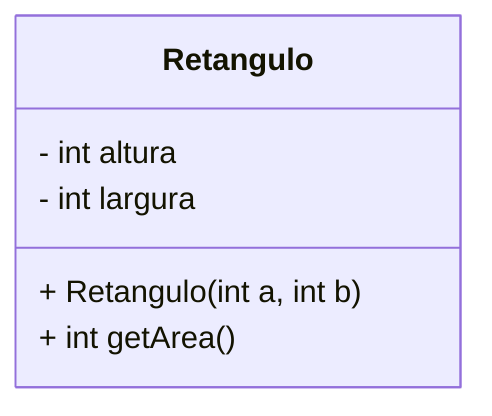
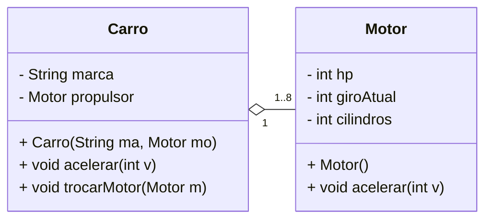

# Diagrama de classes UML

```mermaid
classDiagram
    
    class Retangulo{
        - int altura
        - int largura
        + Retangulo(int a, int b)
        + int getArea()
    }
```

```mermaid
classDiagram
    direction LR
    class Carro{
        - String marca
        - Motor propulsor
        + Carro(String ma, Motor mo)
        + void acelerar(int v)
        + void trocarMotor(Motor m)
    }
    
    class Motor{
        - int hp
        - int giroAtual
        - int cilindros
        + Motor()
        + void acelerar(int v)
    }
    
    Carro "1" o-- "1..8" Motor
```