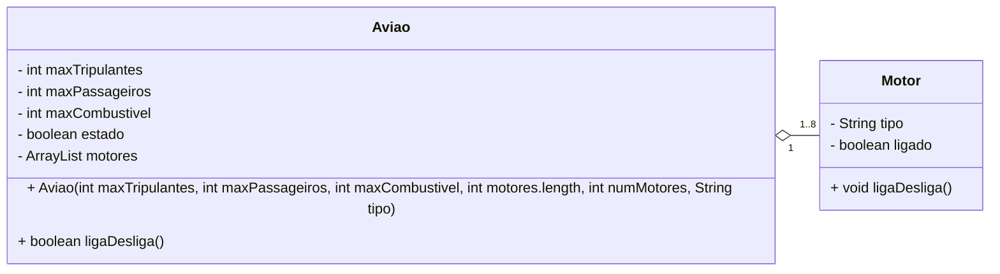

# Diagrama de classes UML
## Jogo Avião

```mermaid
classDiagram
    direction LR
    class Aviao{
        - int maxTripulantes
        - int maxPassageiros
        - int maxCombustivel
        - boolean estado
        - ArrayList<Motor> motores
        + Aviao(int maxTripulantes, int maxPassageiros, int maxCombustivel, int motores.length, int numMotores, String tipo)
        + boolean ligaDesliga()
    }
    
    class Motor{
        - String tipo
        - boolean ligado
        + void ligaDesliga()
    }
    
    Aviao "1" o-- "1..8" Motor
```