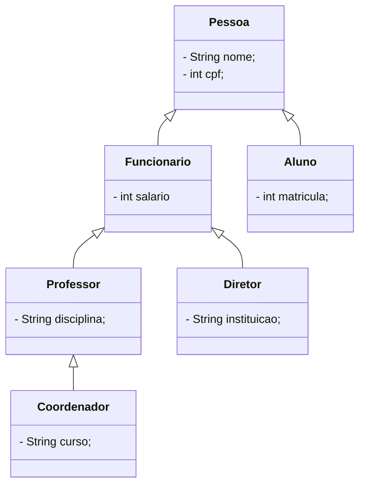
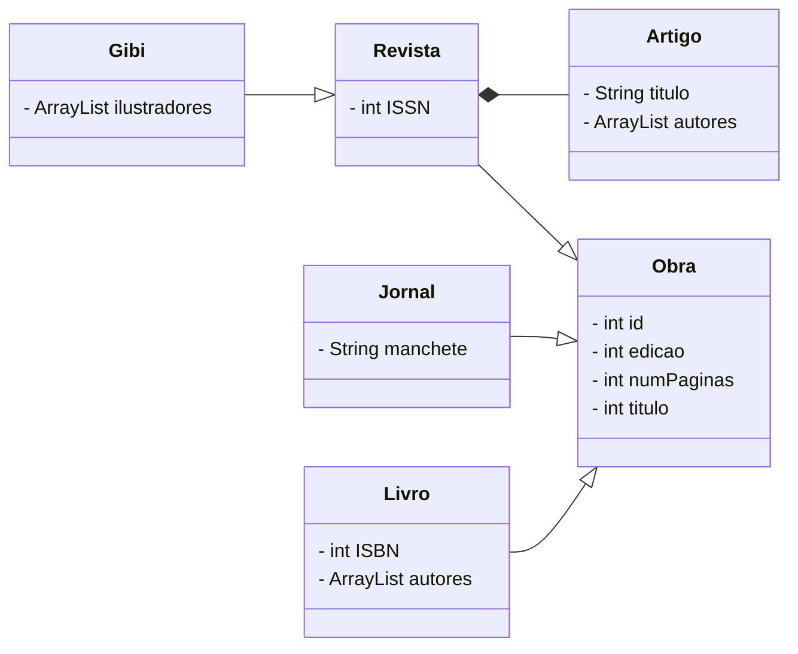

# Exercício - herança

## Aula

```mermaid
classDiagram
    
    class Pessoa{
        - String nome;
        - int cpf;
    }
    
    class Funcionario{
        - int salario
    }
    
    class Aluno{
        - int matricula;
    }
    
    class Professor {
        - String disciplina;
    }
    
    class Coordenador {
        - String curso;
    }
    
    class Diretor {
        - String instituicao;
    }
    
    Pessoa <|-- Aluno
    Pessoa <|-- Funcionario
    Funcionario <|-- Diretor
    Funcionario <|-- Professor
    Professor <|-- Coordenador
```
## Livros

```mermaid

classDiagram
    
    direction LR
    class Obra{
        - int id
        - int edicao
        - int numPaginas
        - int titulo
    }
    
    class Livro{
        - int ISBN
        - ArrayList<String> autores
    }
    
    class Revista{
        - int ISSN
    }
    
    class Jornal{
        - String manchete
    }
    
    class Gibi{
        - ArrayList<String> ilustradores
    }
    
    class Artigo{
        - String titulo
        - ArrayList<String> autores
    }
    
    Livro --|> Obra
    Revista *-- Artigo
    Gibi --|> Revista
    Jornal --|> Obra
    Revista --|> Obra
```

## Veículos
```mermaid

```

## Animais
```mermaid

```
