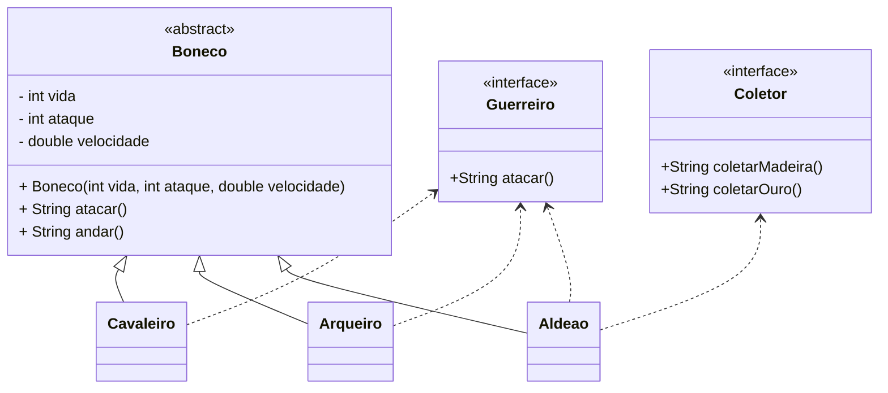

# Java of Empires

```mermaid
classDiagram
    
    direction BT
    
    class Aldeao {
        
    }

    class Arqueiro {
        
    }
    
    class Cavaleiro {
        
    }
    
    class Boneco {
        <<abstract>>
        - int vida
        - int ataque
        - double velocidade
        + Boneco(int vida, int ataque, double velocidade)
        + String atacar()
        + String andar()
    }
    
    class Coletor{
        <<interface>>
        +String coletarMadeira()
        +String coletarOuro()
    }
    
    class Guerreiro{
        <<interface>>
        +String atacar()
    }
    
    Aldeao --|> Boneco
    Arqueiro --|> Boneco
    Cavaleiro --|> Boneco
    Aldeao ..> Guerreiro
    Arqueiro ..> Guerreiro
    Cavaleiro ..> Guerreiro
    Aldeao ..> Coletor
```