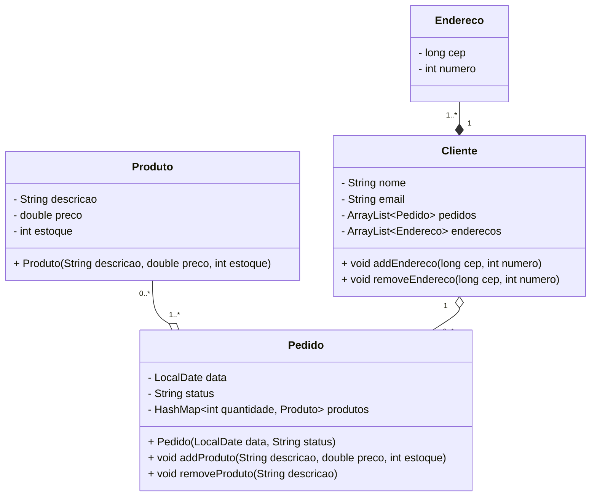
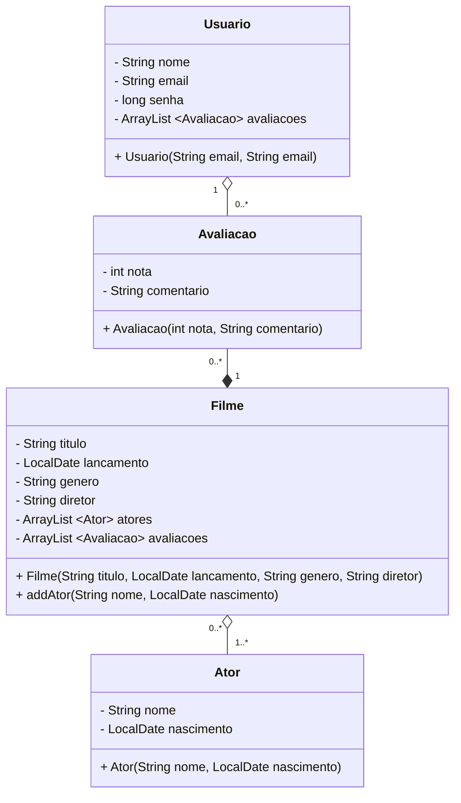

# Lab 4 - Modelagem UML e associação entra classes

## 1.1 Sistema de comércio eletrônico

```mermaid
classDiagram
    
    direction BT
    
    class Produto{
        - String descricao
        - double preco
        - int estoque
        + Produto(String descricao, double preco, int estoque)
    }
    
    class Pedido{
        - LocalDate data
        - String status
        - HashMap~int quantidade, Produto~ produtos
        + Pedido(LocalDate data, String status)
        + void addProduto(String descricao, double preco, int estoque)
        + void removeProduto(String descricao)
    }
    
    class Cliente{
        - String nome
        - String email
        - ArrayList~Pedido~ pedidos
        - ArrayList~Endereco~ enderecos
        + void addEndereco(long cep, int numero)
        + void removeEndereco(long cep, int numero)
    }
    
    class Endereco{
        - long cep
        - int numero
    }
    
    Cliente "1" *-- "1..*" Endereco
    Pedido "1..*" o-- "0..*" Produto
    Pedido "0..*" --o "1" Cliente
```

## 1.2 Sistema de avaliações de filmes

```mermaid
classDiagram
    
    class Filme{
        - String titulo
        - LocalDate lancamento
        - String genero
        - String diretor
        - ArrayList ~Ator~ atores
        - ArrayList ~Avaliacao~ avaliacoes
        + Filme(String titulo, LocalDate lancamento, String genero, String diretor)
        + addAtor(String nome, LocalDate nascimento)
    }
    
    class Usuario{
        - String nome
        - String email
        - long senha
        - ArrayList ~Avaliacao~ avaliacoes
        + Usuario(String email, String email)
        
    }

    class Ator{
        - String nome
        - LocalDate nascimento
        + Ator(String nome, LocalDate nascimento)
    }

    class Avaliacao{
        - int nota
        - String comentario
        + Avaliacao(int nota, String comentario)
    }
    
    Filme "0..*" o-- "1..*" Ator
    Avaliacao "0..*" --* "1" Filme
    Usuario "1" o-- "0..*" Avaliacao
```