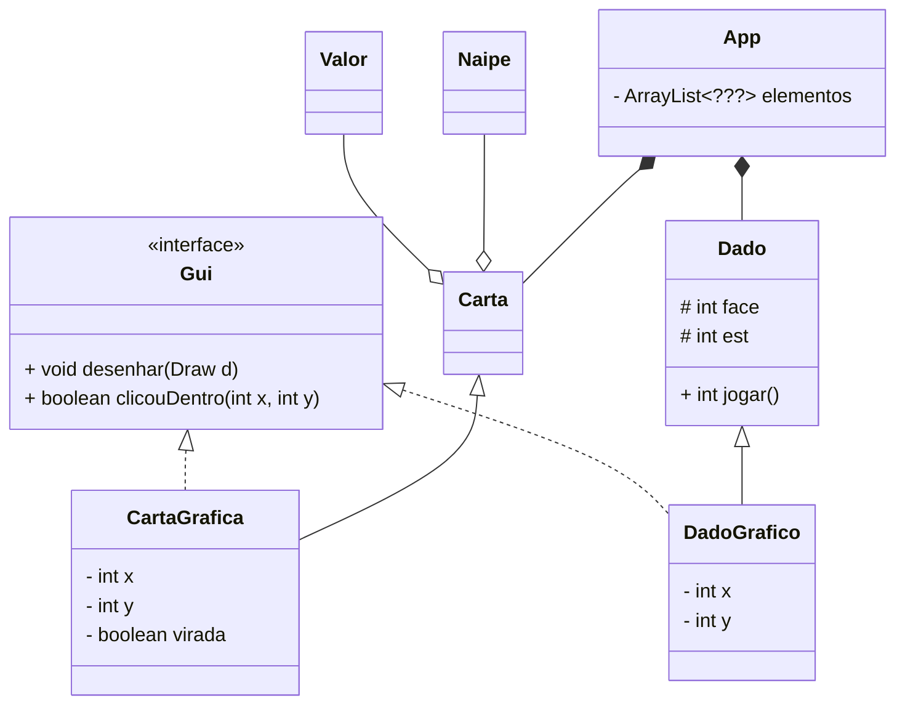

```mermaid

classDiagram
    
    direction TB
    
    App *-- Carta
    App *-- Dado
    Carta <|-- CartaGrafica
    Naipe --o Carta
    Valor --o Carta
    Dado <|-- DadoGrafico
    Gui <|.. DadoGrafico
    Gui <|.. CartaGrafica
    
    class App{
        - ArrayList~???~ elementos
    }

    class Dado{
        # int face
        # int est
        + int jogar()
    }
    
    class CartaGrafica{
        - int x
        - int y
        - boolean virada
    }
    
    class DadoGrafico{
        - int x
        - int y
    }
    
    class Gui{
        <<interface>>
        + void desenhar(Draw d)
        + boolean clicouDentro(int x, int y)
    }
```